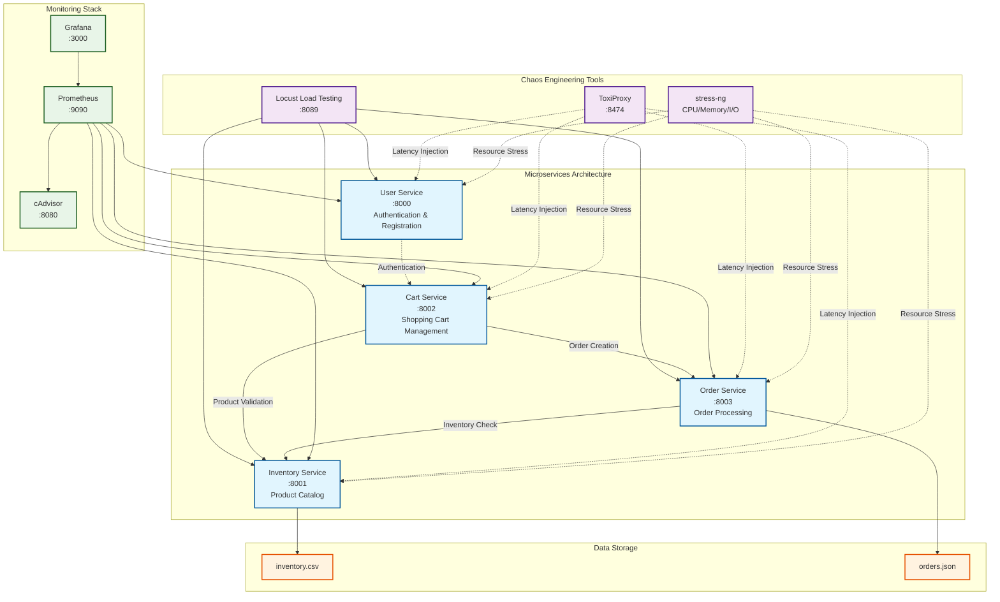
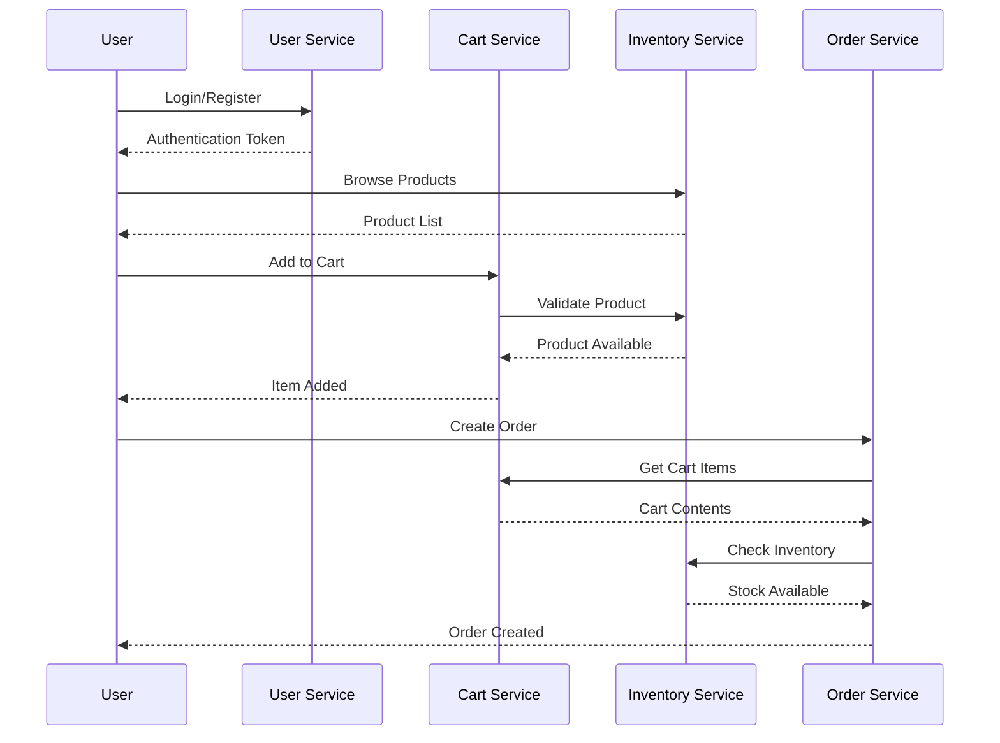
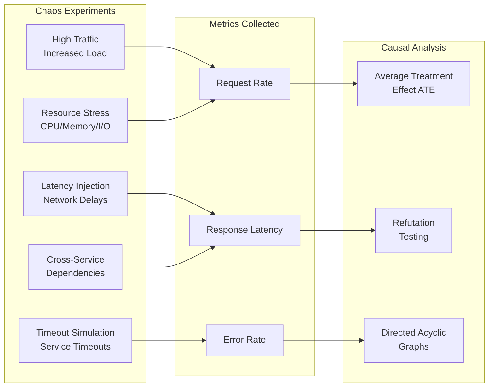
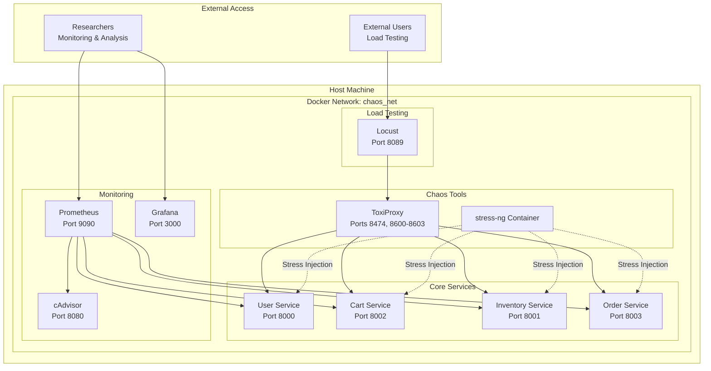

# Microservices Architecture Diagram

## System Overview

```mermaid
graph TB
    subgraph "Chaos Engineering Tools"
        LT[Locust Load Testing<br/>:8089]
        TP[ToxiProxy<br/>:8474]
        ST[stress-ng<br/>CPU/Memory/I/O]
    end

    subgraph "Monitoring Stack"
        PROM[Prometheus<br/>:9090]
        GRAF[Grafana<br/>:3000]
        CAD[cAdvisor<br/>:8080]
    end

    subgraph "Microservices Architecture"
        US[User Service<br/>:8000<br/>Authentication & Registration]
        CS[Cart Service<br/>:8002<br/>Shopping Cart Management]
        IS[Inventory Service<br/>:8001<br/>Product Catalog]
        OS[Order Service<br/>:8003<br/>Order Processing]
    end

    subgraph "Data Storage"
        INV_CSV[inventory.csv]
        ORD_JSON[orders.json]
    end

    %% Load Testing Flow
    LT --> US
    LT --> CS
    LT --> IS
    LT --> OS

    %% Service Dependencies
    US -.->|Authentication| CS
    CS -->|Product Validation| IS
    CS -->|Order Creation| OS
    OS -->|Inventory Check| IS

    %% Monitoring
    PROM --> US
    PROM --> CS
    PROM --> IS
    PROM --> OS
    PROM --> CAD

    GRAF --> PROM

    %% Data Storage
    IS --> INV_CSV
    OS --> ORD_JSON

    %% Chaos Injection Points
    TP -.->|Latency Injection| US
    TP -.->|Latency Injection| CS
    TP -.->|Latency Injection| IS
    TP -.->|Latency Injection| OS

    ST -.->|Resource Stress| US
    ST -.->|Resource Stress| CS
    ST -.->|Resource Stress| IS
    ST -.->|Resource Stress| OS

    %% Styling
    classDef service fill:#e1f5fe,stroke:#01579b,stroke-width:2px
    classDef tool fill:#f3e5f5,stroke:#4a148c,stroke-width:2px
    classDef monitor fill:#e8f5e8,stroke:#1b5e20,stroke-width:2px
    classDef storage fill:#fff3e0,stroke:#e65100,stroke-width:2px

    class US,CS,IS,OS service
    class LT,TP,ST tool
    class PROM,GRAF,CAD monitor
    class INV_CSV,ORD_JSON storage
```

## Service Dependencies Flow

```mermaid
sequenceDiagram
    participant U as User
    participant US as User Service
    participant CS as Cart Service
    participant IS as Inventory Service
    participant OS as Order Service

    U->>US: Login/Register
    US-->>U: Authentication Token

    U->>IS: Browse Products
    IS-->>U: Product List

    U->>CS: Add to Cart
    CS->>IS: Validate Product
    IS-->>CS: Product Available
    CS-->>U: Item Added

    U->>OS: Create Order
    OS->>CS: Get Cart Items
    CS-->>OS: Cart Contents
    OS->>IS: Check Inventory
    IS-->>OS: Stock Available
    OS-->>U: Order Created
```

## Chaos Engineering Experiment Types

```mermaid
graph LR
    subgraph "Chaos Experiments"
        HT[High Traffic<br/>Increased Load]
        LI[Latency Injection<br/>Network Delays]
        TS[Timeout Simulation<br/>Service Timeouts]
        RS[Resource Stress<br/>CPU/Memory/I/O]
        CD[Cross-Service<br/>Dependencies]
    end

    subgraph "Metrics Collected"
        RR[Request Rate]
        RL[Response Latency]
        ER[Error Rate]
    end

    subgraph "Causal Analysis"
        ATE[Average Treatment<br/>Effect ATE]
        REF[Refutation<br/>Testing]
        DAG[Directed Acyclic<br/>Graphs]
    end

    HT --> RR
    LI --> RL
    TS --> ER
    RS --> RR
    CD --> RL

    RR --> ATE
    RL --> REF
    ER --> DAG
```

## Experimental Setup Architecture

```mermaid
graph TB
    subgraph "Host Machine"
        subgraph "Docker Network: chaos_net"
            subgraph "Core Services"
                US[User Service<br/>Port 8000]
                CS[Cart Service<br/>Port 8002]
                IS[Inventory Service<br/>Port 8001]
                OS[Order Service<br/>Port 8003]
            end

            subgraph "Chaos Tools"
                TP[ToxiProxy<br/>Ports 8474, 8600-8603]
                ST[stress-ng Container]
            end

            subgraph "Load Testing"
                LC[Locust<br/>Port 8089]
            end

            subgraph "Monitoring"
                PROM[Prometheus<br/>Port 9090]
                GRAF[Grafana<br/>Port 3000]
                CAD[cAdvisor<br/>Port 8080]
            end
        end
    end

    subgraph "External Access"
        USER[External Users<br/>Load Testing]
        ADMIN[Researchers<br/>Monitoring & Analysis]
    end

    USER --> LC
    LC --> TP
    TP --> US
    TP --> CS
    TP --> IS
    TP --> OS

    PROM --> US
    PROM --> CS
    PROM --> IS
    PROM --> OS
    PROM --> CAD

    ADMIN --> GRAF
    ADMIN --> PROM

    ST -.->|Stress Injection| US
    ST -.->|Stress Injection| CS
    ST -.->|Stress Injection| IS
    ST -.->|Stress Injection| OS
```
